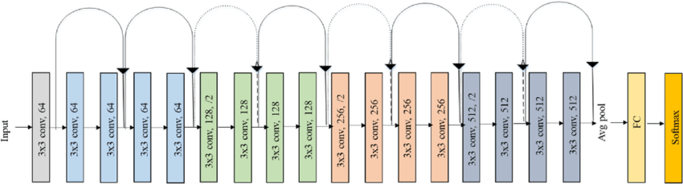
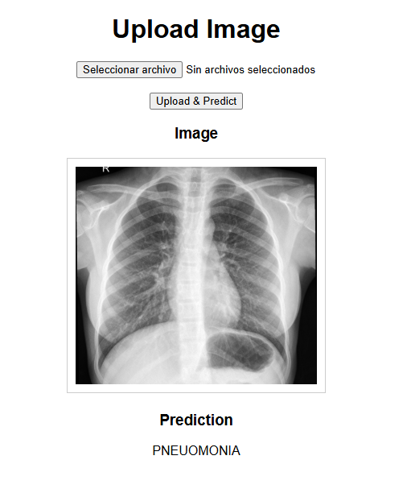
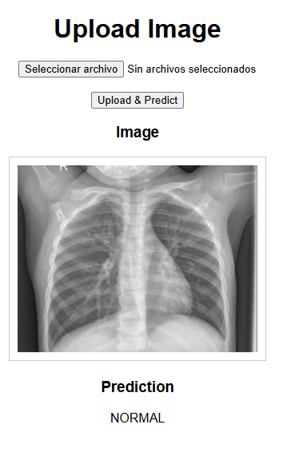

# Pneumonia Classifier
## Overview
This project aims to develop a deep learning model capable of detecting pneumonia from chest X-ray images. Leveraging a ResNet18 architecture, the model is trained to distinguish between normal and pneumonia-affected lungs. The training process utilizes high-performance computing (HPC) resources to handle the computational demands of deep learning. Additionally, the model is deployed as a serverless application using RunPod, enabling scalable and efficient inference.

## Technologies Used
- __Python__: The primary programming language for scripting and model development.
- __PyTorch__: A deep learning framework used to build and train the ResNet18 model.
- __Flask__: A micro web framework employed to create a web-based interface for the classifier. 
- __Conda__: An environment management system to handle dependencies and package installations.
- __High-Performance Computing (HPC)__: Utilized to accelerate the training process by leveraging powerful computational resources.
- __RunPod__: A platform for deploying serverless GPU applications, facilitating scalable and efficient model inference.

## Theory 
__Deep Learning in Medical Imaging__: Convolutional Neural Networks (CNNs), such as ResNet18, have shown significant promise in medical image analysis. These networks can automatically and adaptively learn spatial hierarchies of features from input images, making them suitable for tasks like pneumonia detection from chest X-rays.

__ResNet18 Architecture__: ResNet18 is a variant of the ResNet (Residual Networks) family, designed to address the vanishing gradient problem in deep networks by introducing residual connections. This architecture allows for the training of deeper networks without performance degradation, making it effective for image classification tasks.

__Serverless Deployment with RunPod__: Deploying the trained model as a serverless application using RunPod allows for scalable and efficient inference. RunPod's serverless platform enables the model to handle varying loads without the need for manual scaling, ensuring that resources are utilized effectively.

## Conclusion
The development of a pneumonia classifier using deep learning techniques, particularly with architectures like ResNet18, demonstrates the potential of AI in assisting medical diagnostics. By leveraging HPC resources, the training process becomes more efficient, allowing for the handling of large datasets and complex models. Deploying the trained model as a serverless application using RunPod further enhances accessibility and scalability, enabling healthcare professionals to utilize the tool in real-time clinical settings. Continued advancements in this field hold promise for improving patient outcomes through timely and accurate disease detection.

