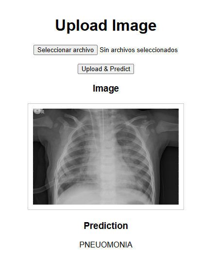
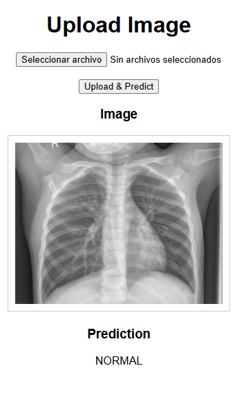

We are going to use a ResNet18
We use an HPC server of the uni lu to train the model

enter to the HPC, and get a cluster with a GPU

```  si-gpu ``` 

Install conda if not installed

```bash
(node)$> wget https://repo.anaconda.com/miniconda/Miniconda3-latest-Linux-x86_64.sh
(node)$> chmod u+x Miniconda3-latest-Linux-x86_64.sh
(node)$> ./Miniconda3-latest-Linux-x86_64.sh
```

The installation will modify your .bashrc to make conda directly available after each login. To activate the changes now, run

```bash
(node)$> source ~/.bashrc
```

Create an environment

```bash
(node)$> conda create -n python_tutorial
(node)$> conda activate python_tutorial
```
install pip
```bash
conda install pip
```
Install the requirements
```bash
pip install -r requirements.txt
```

To train the model, both of the script and the data need to be in the same directory, in this case:

__train_pneumonia/__

After running the script:

```bash
python train_model.py
```

We wait for it to finish and save the weights as: __pneumonia_classifiers.pth__

Then we will create a pod on __runpod.io__ to handle the serverless application and also we will dockerize the application. 

This will allow us to create a serverless application. To upload images from chest xrays and classify them wheter they have PNEUMONIA or NOT.





The model was a CNN with a train accuracy score of 94%